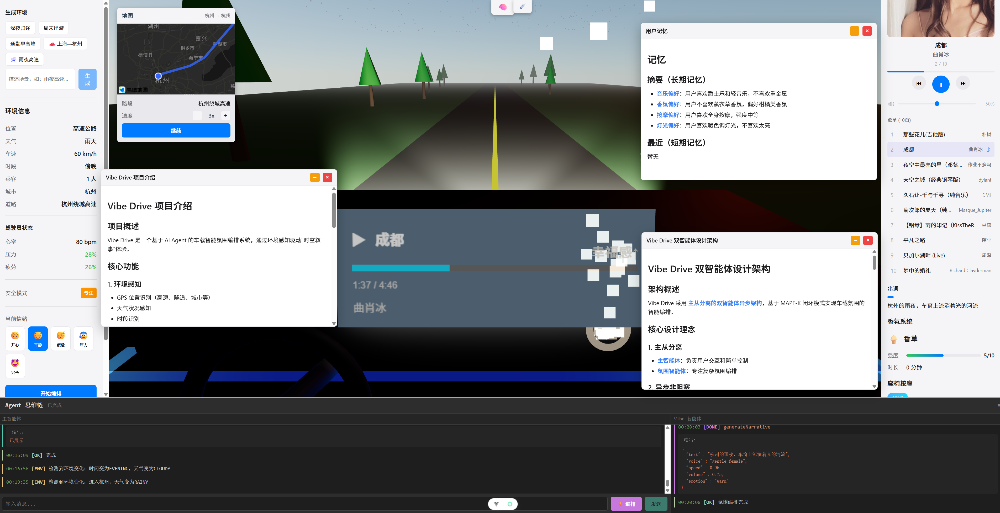

# Vibe Drive

基于 AI Agent 的车载智能氛围编排系统，通过环境感知驱动"时空叙事"体验。

**在线演示**: https://vibe.fzhiyu2333.top/



## 功能特性

### 🤖 智能体系统
- **双智能体架构** - 主智能体（对话交互）+ 氛围智能体（环境编排）
- **21个专用工具** - 音乐/灯光/香氛/按摩/叙事/地图等
- **跨会话记忆** - 记住用户偏好，支持长期/短期记忆分区
- **RAG 元认知** - 项目自知能力，可介绍自身架构
- **模型自动降级** - Claude ↔ DeepSeek 自动切换

### 🎨 氛围控制
- **音乐** - 智能推荐、播放列表管理、音量控制
- **灯光** - 颜色/亮度/模式（静态/呼吸/渐变/脉冲）
- **香氛** - 6种香型（薰衣草/薄荷/海洋/森林/柑橘/香草）
- **按摩** - 5种模式（放松/活力/舒适/运动/关闭）
- **叙事** - TTS 语音播报，情感化串词

### 🌍 环境感知
- **高德地图** - 位置可视化、行驶模拟
- **多维感知** - GPS标签/天气/车速/时段/乘客
- **安全模式** - L1正常(<60) / L2专注(60-100) / L3静默(≥100)
- **自动检测** - 环境变化触发氛围调整

### 🎬 可视化
- **Three.js** - 车内3D场景、氛围灯效果
- **天气动画** - 晴/云/雨/雪/雾粒子效果
- **速度感** - 粒子流动效果
- **思维链** - 双栏实时展示 Agent 推理过程

## 项目结构

```
Vibe-Drive/
├── vibe-drive-backend/    # Java 后端 (Spring Boot 3.x)
├── vibe-drive-frontend/   # 前端 (Vue 3 + TypeScript)
├── vibe-drive-tts/        # TTS 语音服务 (Node.js)
├── services/music-api/    # 音乐 API 服务 (Go)
├── docker/                # Docker 配置
└── docs/                  # 文档
```

## 环境要求

- **Docker Desktop** (用于音乐服务)
- **Node.js 20+** (用于 TTS 服务和前端)
- **Java 21** (用于后端)
- **Maven** (用于后端构建)

## 快速启动

### 1. 启动音乐服务 (Docker)

```bash
cd docker
docker-compose up -d
```

验证：`curl http://localhost:8081/api/music/search?keyword=test`

### 2. 启动 TTS 服务 (本地 Node.js)

```bash
cd vibe-drive-tts
npm install    # 首次运行
npm run dev
```

验证：`curl http://localhost:3002/health`

> ⚠️ TTS 服务需本地运行，Docker 内有兼容性问题

### 3. 启动后端 (Java)

```bash
cd vibe-drive-backend
./mvnw spring-boot:run
```

验证：`curl http://localhost:8080/api/vibe/status`

### 4. 启动前端 (Vue)

```bash
cd vibe-drive-frontend
npm install    # 首次运行
npm run dev
```

访问：http://localhost:5173

## 服务端口

| 服务 | 端口 | 技术栈 | 说明 |
|------|------|--------|------|
| 音乐 | 8081 | Go | 网易云音乐 API |
| TTS | 3002 | Node.js | Edge TTS 语音合成 |
| 后端 | 8080 | Spring Boot | AI Agent 编排 |
| 前端 | 5173 | Vue 3 | 用户界面 |

## 配置

### 后端配置

1. 复制配置模板：

```bash
cd vibe-drive-backend/src/main/resources
cp application.yml.example application.yml
```

2. 编辑 `application.yml`，配置 API Key：

```yaml
langchain4j:
  # 模型提供商: openai / anthropic
  provider: anthropic

  # OpenAI 配置 (支持 DeepSeek 等兼容 API)
  open-ai:
    chat-model:
      base-url: https://api.deepseek.com
      api-key: your-deepseek-api-key
      model-name: deepseek-chat

  # Anthropic 配置
  anthropic:
    chat-model:
      base-url: https://api.anthropic.com
      api-key: your-anthropic-api-key
      model-name: claude-opus-4-5-20251101
```

### 模型降级机制

系统支持自动模型降级：
- 主模型失败时自动切换到降级模型
- 5 分钟冷却后尝试恢复主模型
- `provider: anthropic` → 主模型 Claude，降级到 DeepSeek
- `provider: openai` → 主模型 DeepSeek，降级到 Claude

## 访问

打开浏览器访问 http://localhost:5173

## 技术架构

```
┌─────────────────────────────────────────────────────────────┐
│                      Frontend (Vue 3)                       │
│  ┌─────────┐ ┌─────────┐ ┌─────────┐ ┌─────────┐           │
│  │ Three.js│ │ 高德地图 │ │   TTS   │ │  Pinia  │           │
│  └─────────┘ └─────────┘ └─────────┘ └─────────┘           │
└─────────────────────────┬───────────────────────────────────┘
                          │ SSE / REST
┌─────────────────────────▼───────────────────────────────────┐
│                   Backend (Spring Boot)                     │
│  ┌─────────────┐  ┌─────────────┐  ┌─────────────┐         │
│  │ MasterAgent │  │  VibeAgent  │  │ MemoryStore │         │
│  └──────┬──────┘  └──────┬──────┘  └─────────────┘         │
│         │                │                                  │
│  ┌──────▼────────────────▼──────┐  ┌─────────────┐         │
│  │      21 Tools (LangChain4j)  │  │  RAG Store  │         │
│  └──────────────────────────────┘  └─────────────┘         │
└─────────────────────────┬───────────────────────────────────┘
                          │
┌─────────────────────────▼───────────────────────────────────┐
│                    External Services                        │
│  ┌─────────┐ ┌─────────┐ ┌─────────┐ ┌─────────┐           │
│  │ Claude  │ │DeepSeek │ │Music API│ │ TTS API │           │
│  └─────────┘ └─────────┘ └─────────┘ └─────────┘           │
└─────────────────────────────────────────────────────────────┘
```

## 文档

详细设计文档位于 `docs/` 目录：

| 文档 | 说明 |
|------|------|
| [架构设计](docs/design/architecture.md) | 系统架构、MAPE-K 闭环 |
| [API 规范](docs/design/api-spec.md) | RESTful 接口定义 |
| [记忆系统](docs/design/memory-system.md) | 跨会话记忆设计 |
| [工具接口](docs/design/tool-interface.md) | Tool 设计原则 |

## License

MIT